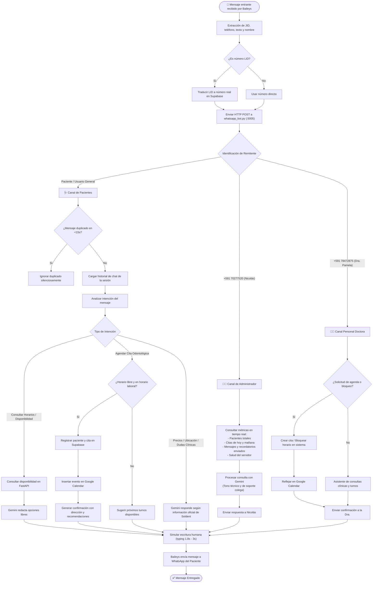
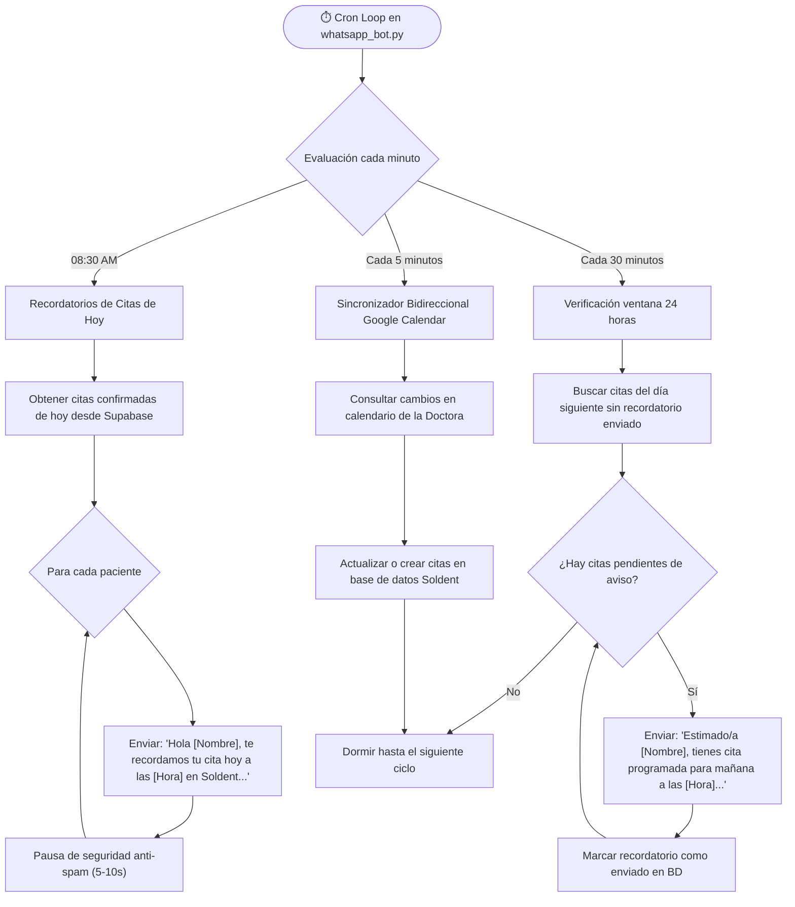

# 📊 Diagrama de Flujo Integral - Sistema Soldent

Este documento detalla el funcionamiento completo del ecosistema **Soldent**: su infraestructura en la nube, el flujo de decisiones del bot de WhatsApp con Inteligencia Artificial, y la sincronización con la base de datos y Google Calendar.

---

## 1. 🏗️ Arquitectura General del Sistema

```mermaid
flowchart TD
    subgraph Usuarios ["👥 Actores del Sistema"]
        PAC["🩺 Pacientes"]
        DOC["👩‍⚕️ Dra. Pamela (+591 78472875)"]
        ADM["👨‍💻 Nicolás Admin (+591 70277520)"]
    end

    subgraph Canales ["📡 Canales de Entrada"]
        WA_APP["💬 WhatsApp Web / App"]
        WEB_UI["🌐 Agenda Web (Navegador)"]
    end

    subgraph ServidorOracle ["☁️ Servidor Principal (Oracle Cloud 146.181.38.79)"]
        NGINX["🛡️ Nginx Reverse Proxy (Puerto 80)"]
        FASTAPI["⚙️ Backend FastAPI (main.py :8000)"]
        GATEWAY["📱 Baileys Gateway (server.js :8080)"]
        BOT_AI["🤖 Bot IA & Workers (whatsapp_bot.py :5005)"]
    end

    subgraph ServidorBackup ["☁️ Servidor Respaldo (Render Cloud)"]
        RENDER_BACKEND["⚙️ FastAPI Backup (Modo Web / Bot Standby)"]
    end

    subgraph ServiciosNube ["🗄️ Servicios Externos en la Nube"]
        SUPABASE[("🐘 Supabase PostgreSQL\n- Schema: agenda\n- Sesión Baileys\n- Pacientes, Citas, Pagos")]
        GCAL["📅 Google Calendar API\n(Sincronización Bidireccional)"]
        GEMINI["🧠 Google Gemini AI\n(Procesamiento de Lenguaje Natural)"]
    end

    PAC -->|Escribe mensaje| WA_APP
    DOC -->|Escribe mensaje| WA_APP
    ADM -->|Escribe comando / consulta| WA_APP
    DOC & ADM -->|Gestionan agenda| WEB_UI

    WEB_UI -->|HTTP / HTTPS| NGINX
    NGINX -->|Proxy pass :8000| FASTAPI

    WA_APP <-->|WebSocket Baileys| GATEWAY
    GATEWAY -->|HTTP POST Webhook :5005| BOT_AI
    BOT_AI -->|HTTP POST /send-message :8080| GATEWAY

    BOT_AI <-->|Consultas CRUD internas| FASTAPI
    FASTAPI <-->|SQL Pooler (Transacciones y UPSERT)| SUPABASE
    GATEWAY <-->|Persistencia y restauración de sesión| SUPABASE

    FASTAPI <-->|OAuth2 Sync Citas| GCAL
    BOT_AI <-->|Prompt + Historial| GEMINI

    RENDER_BACKEND -.->|Standby Failover| SUPABASE
```

---

## 2. 🧠 Flujo de Procesamiento de Mensajes de WhatsApp



---

## 3. ⏰ Ciclo de Workers Automáticos en Segundo Plano



---

## 4. 🛡️ Blindaje y Tolerancia a Fallos (Failover)

| Componente | Mecanismo de Protección | Solución Implementada |
| :--- | :--- | :--- |
| **Persistencia Baileys** | Colisión de claves al sincronizar | `UPSERT` atómico en PostgreSQL (`ON CONFLICT (key) DO UPDATE`) |
| **Conflicto Multiserver** | Dos servidores corriendo Baileys (Código 440) | Detección de `connectionReplaced` + pausa de 5 min + `DISABLE_WHATSAPP` en Render |
| **Reinicio de Servidor** | Reinicio no planeado de la máquina virtual | Servicio `systemd (soldent.service)` con auto-restart continuo |
| **Memoria RAM** | Límite de 1 GB en VM gratuita | Swappiness optimizado con swapfile de 2 GB + límite V8 `--max-old-space-size=250` |
| **Anti-Spam de Meta** | Detección de automatización en WhatsApp | Delay aleatorio de tipeo humano (1.8s a 3.3s) antes de cada mensaje |
